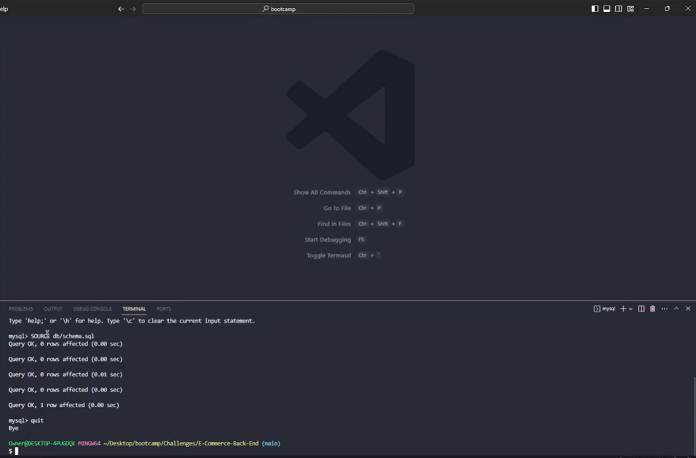

# E-Commerce-Back-End

## Screenshot

## Description

A back end for an e-commerce website that uses the latest technologies so that a company can compete with other e-commerce companies.

## Table of Contents

- [Technology](#technology)
- [Installation](#installation)
- [Testing](#testing)
- [Links](#links)
- [License](#license)

## Technologies Used 

## Installation 

To install this application, git clone thie repository to your local computer. The user must also install Node.js in order to use this application As well as install the express.js, mysql2, dotenv packages.

## Testing 

You can test this application by running the command line prompt "npm start" after installing the required node packages from VS code and using insomnia to perform the Get, Post, Put and Delete API actions.

## Links 

GitHub Repo: https://github.com/SherryK1103/E-Commerce-Back-End

Walk-through: https://drive.google.com/file/d/174liSHEB_nrz9nCrZYTgBmyHWvEkrQNI/view

## Licenses 

This project is covered under the MIT License https://opensource.org/licenses/MIT
